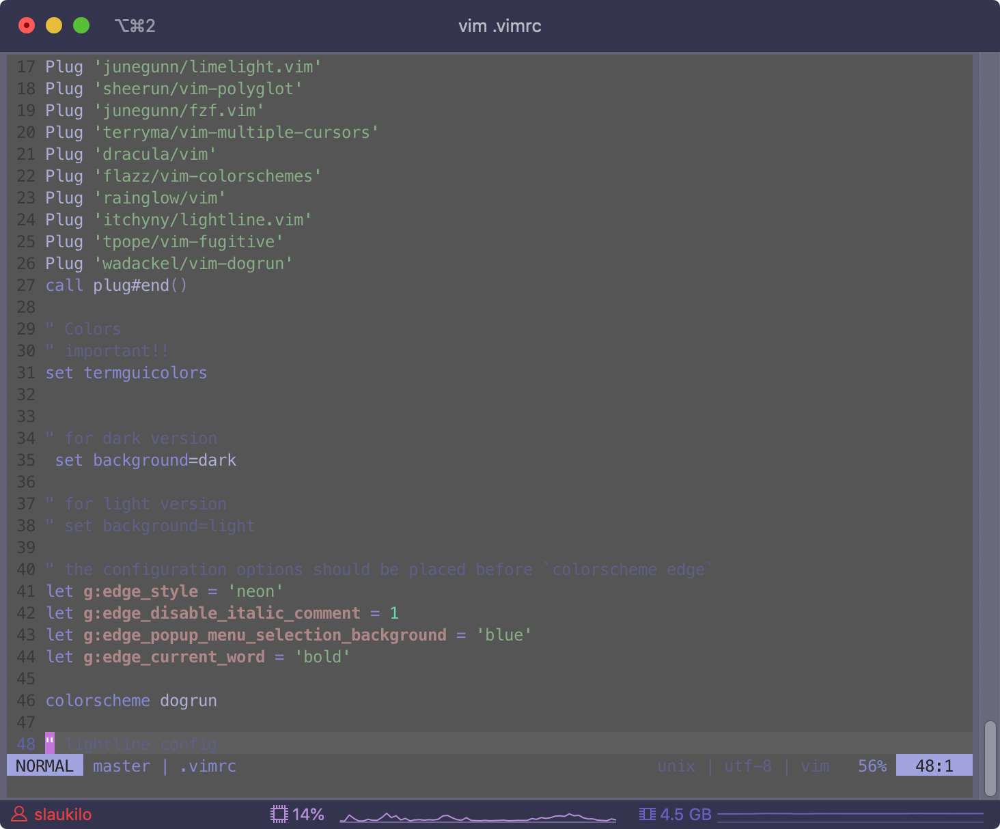

# dotfiles
My macOS dotfiles for vim, zsh, git, brew and install configuration files..
Files closely follow the guidlines found here --> http://dimafeng.com/2016/10/09/dotfiles/ with the dotfile found at https://github.com/dimafeng/dotfiles


## Installation ##
To install the config:
```
cd ~
git clone https://github.com/slaukilo/dotfiles.git
cd ~/dotfiles
sh install.sh link

# install linux & macos compatible parts
sh install.sh install_commons

# install macos applications
sh install.sh install_app_mac
```
### Install Homebrew Formulae ###
When setting up a macOS environment it is much more efficient to utilize brew formulae with a convenient list found here --> [casks](https://formulae.brew.sh/cask/) and [macOS formulae](https://formulae.brew.sh/formula/). Run:
```./brew.sh```

### iTerm configuration ###
To load iTerm profile, go to __Preferences__ -> __Profiles Tab__ and in the profile selector tab on the left, go to the bottom and select __Other Actions__ then __Load JSON Profiles__. From there load in the JSON profile from the iterm directory.

## Terminal Preview ##
*Config*
* Font ```Meslo LG S for Powerline```
* Non-ASCII Font ```SourceCodePro+Powerline```
* Terminal ```iTerm2```
* zsh-theme ```powerlevel9k```


## Vim ##
*Config*
* Plugin Manager ```vim-plug```
* Theme ```dogrun``` [github-link](https://github.com/wadackel/vim-dogrun)

Vim utilizes the [vim-plug](https://github.com/junegunn/vim-plug) package for plugin installs and updates.

# Screenshot #


